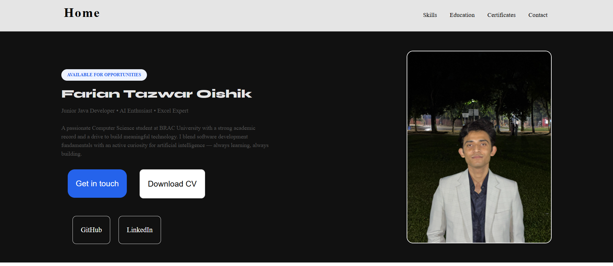
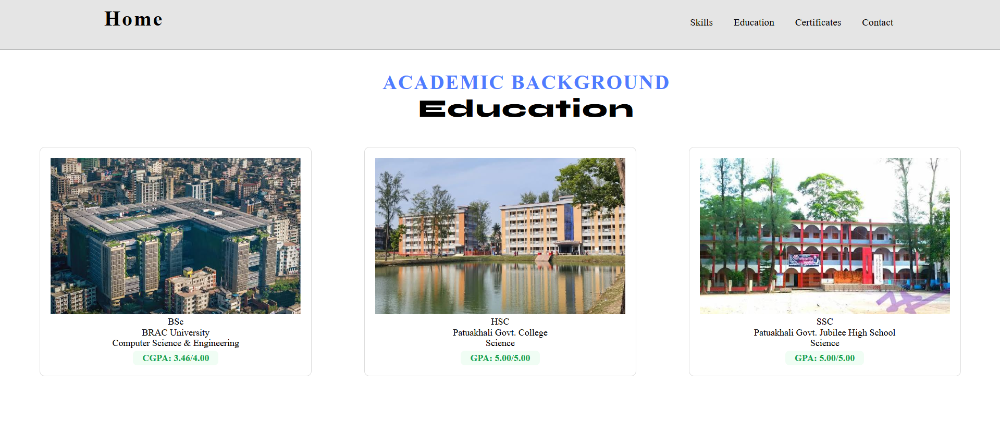
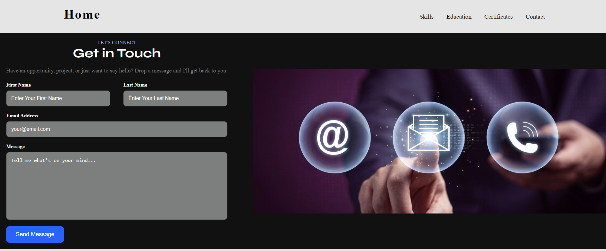

# Farian Tazwar Oishik — Portfolio Website

A personal portfolio website showcasing my background, skills, education, and certifications as a Computer Science student and aspiring developer.

**🔗 Live Site:** [farian2006.github.io/farian-portfolio](https://farian2006.github.io/farian-portfolio/)


---

## 📖 About

This is a multi-page personal portfolio site built from scratch with plain HTML and CSS. It introduces me as a Junior Java Developer, AI enthusiast, and Excel expert, and shares my academic background, technical skills, and certifications.

## ✨ Features

- **Home** — Introduction, short bio, and quick links to GitHub/LinkedIn
- **Skills** — Overview of technical skills (Java, AI/ML fundamentals, MS Excel, MERN stack, Google Analytics, Graphics Design)
- **Education** — Academic history from SSC through university
- **Certificates** — Certifications and training credentials
- **Contact** — A contact form to get in touch

## 📸 Screenshots

| Home | Education | Contact |
|:---:|:---:|:---:|
|  |  |  |

## 🛠️ Built With

- **HTML5** — page structure and content
- **CSS3** — custom styling (no frameworks)
- [Google Fonts](https://fonts.google.com/) — DM Sans, Inter, League Spartan, Open Sans, Syne
- [Font Awesome](https://fontawesome.com/) — social and UI icons

## 📁 Project Structure

```
farian-portfolio/
├── index.html          # Home page
├── skills.html         # Skills & expertise
├── education.html      # Academic background
├── certificates.html   # Certifications
├── contact.html        # Contact form
├── style.css           # Global stylesheet
└── images/             # Site images and icons
```

## 🚀 Getting Started

To run this project locally:

```bash
# Clone the repository
git clone https://github.com/farian2006/farian-portfolio.git

# Navigate into the project folder
cd farian-portfolio

# Open index.html in your browser
```

No build tools or dependencies required — it's a static site you can open directly in a browser.

## 🌐 Deployment

This site is deployed with **GitHub Pages** directly from the `main` branch.

## 📬 Contact

- **LinkedIn:** [fariantazwar2005](https://www.linkedin.com/in/fariantazwar2005)
- **GitHub:** [@farian2006](https://github.com/farian2006)

## 📄 License

This project is open for reference and learning purposes. Please don't copy the personal content (name, bio, certificates) as your own.
